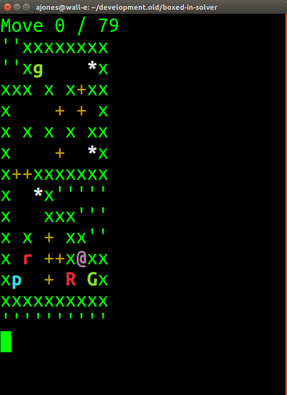

# boxed-in-solver

A* search implementation for the _Boxed In_ game.

The solver parses a text representation of a level from file and searches for the optimal solution.

TODO: Add example level image and corresponding level file.

## Build Instructions - Linux

1. Install dependencies:
```
sudo apt install -y \
  cmake \
  googletest \
  libboost-all-dev \
  libfmt-dev
```
1. Clone boxed-in-solver source: `git clone https://github.com/aaronmjones/boxed-in-solver.git`
1. Build
```
cd boxed-in-solver
mkdir build
cd build
cmake ..
cmake --build . # Or run make all
```

## Build Instructions - Windows

1. Install cmake
1. Install boost
   * Download boost 1.65.1
   * Build and install
```
bootstrap.bat
b2.exe --prefix=C:\boost_1_65_1 install
```
1. Download solver source
1. Build
```
mkdir build
cd build
cmake -G"Visual Studio 15 2017" --config Release -DBOOST_ROOT=C:\boost_1_65_1 -DBoost_USE_STATIC_LIBS=ON ..
cmake --build . # Or open the generated visual studio solution (in build folder) and build project.
```

## Build Instructions - Mac

1. Install dependencies:
```
brew install boost
brew install cmake
brew install fmt
brew install googletest
```
1. Clone boxed-in-solver source: `git clone https://github.com/aaronmjones/boxed-in-solver.git`
1. Build
```
cd boxed-in-solver
mkdir build
cd build
cmake ..
cmake --build .
```

## Run Unit Tests

```
cd build/test
ctest # Or run an individual test binary in build/test directory
```

## Docker instructions

Build the docker image
```
docker build -t boxed-in-solver-debian-buster docker/debian-buster
```
A docker image is created with the tag `boxed-in-solver-debian-buster` from a Dockerfile located in `build/docker/debian-buster`.

Build the project
```
docker run -v ~/git/boxed-in-solver:/boxed-in-solver \
           -t boxed-in-solver-debian-buster \
           bash -c "cmake .. && cmake --build ."
```

Run interactive shell
```
docker run -v ~/git/boxed-in-solver:/boxed-in-solver -it boxed-in-solver-debian-buster bash
```

## Running the solver

To run the solver on Boxed In 1, Level 1 data, execute the following from the **boxed-in-solver/build** directory:

```
./solve -l level-data/1/01.txt
```
The level and some statistics will be written to stderr. If the search was successful, the solution will be written to stdout. The solution is a string of {U,D,L,R} characters.

output
```
Boxed In Level:
''''''''''
''''''''''
''''''''''
''''''''''
'xxxxxxxx'
'x  +  xx'
'xp +  @x'
'x  +  xx'
'xxxxxxxx'
''''''''''
''''''''''
''''''''''
''''''''''
''''''''''
Thu Nov 23 09:07:46 2017

Thu Nov 23 09:07:46 2017

A* search succeeded
SEARCHTIME 0
Level can be solved in 7 moves
A* search time was 0.000375705 seconds
Nodes in open set 30
Nodes in closed set 9
MAXRSS 4212000

RRRURDR
```

You can write the solution to a file by redirecting stdout to a solution file. You can then use this solution with the `validate` utility to view a animation of the level being solved in the console.

To solve boxed-in 3, level 2 and write solution to file, execute the following from teh **boxed-in-solver/build** directory:
```
./solve -l level-data/3/02.txt > solution-data/3/02.txt
```

## Validating a solution

To run the solution validator on Boxed In 1, Level 7 data, execute the following from the **boxed-in-solver/build** directory:

```
./validate -l level-data/1/07.txt -s solution-data/1/07.txt
```

TODO: replace with animated GIF

